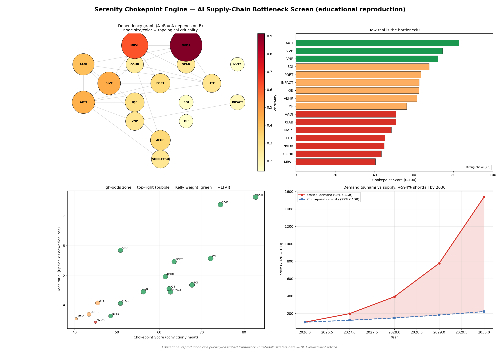

# Serenity Chokepoint Engine 瓶颈/咽喉量化引擎

复刻网红交易员 **Serenity (@aleabitoreddit)** 的 *Chokepoint Theory（咽喉理论）*，
把它从一套叙事框架变成一个**可运行、可审计、可扩展的量化筛选引擎**，用于挖掘 AI 算力供应链中
被市场忽视的「高赔率」瓶颈股。

> ⚠️ **免责声明 / Disclaimer**：本模块是对一套**公开描述**的投资框架的**教育性复刻**。
> `chokepoint_data.py` 里的数据是根据公开报道（Serenity 的 X/Substack、
> singularityresearchfund、archetype-research、semiconstocks tracker、公司财报等，截至 ~2026-05）
> **手工整理的近似估计值**，用于演示方法论，**不是实时财务数据，也不构成任何投资建议**。

---

## 核心思想 / Core idea

不追「鱼肚」（NVIDIA、TSMC），去找寿司里那片不可或缺的「紫苏叶」——
物理上不可替代、供给高度集中、认证周期极长、机构尚未发现的小市值「螺丝钉」环节。
就像全球 20% 石油必经霍尔木兹海峡，AXTI 之于光子学 InP 衬底就是同一种咽喉。

## 引擎做了什么 / What it computes

对每个供应链节点输出两类东西，对应 Serenity 的流程：

1. **Chokepoint Score (0–100)** — *这是不是真瓶颈？* 六大支柱加权（`scoring.py`）：

   | 支柱 | 权重 | 含义 |
   |------|-----:|------|
   | supply_concentration | 22 | Top1–3 份额，>70% 为硬门槛，超过后非线性加分 |
   | irreplaceability | 22 | 材料/物理替代难度 × 认证周期长度 |
   | demand_supply_gap | 16 | 终端 AI 需求 CAGR 远超该节点产能 CAGR |
   | qualification_barrier | 16 | 已被 hyperscaler/NVDA 认证 + 12–24 月周期 |
   | information_asymmetry | 14 | 小市值 + 低机构持股 + 少分析师覆盖（alpha 来源）|
   | catalyst_optionality | 10 | 内部增持、高 short interest、并购溢价、垂直整合 |

2. **Asymmetric payoff（不对称赔率）** — *这是不是高赔率赌注？*
   把结构性护城河映射成**胜率 win_prob**，对 ramp 倍数（venture-style，非 TTM P/S）建模**上行 upside**，
   对稀释/估值/技术路线/流动性风险建模**下行 downside**，得到：
   - `odds_ratio = upside / downside`（赔率）
   - `expected_value`（每 1 美元的期望收益）
   - `kelly_weight`（1/10 分数 Kelly + 10% 上限的建议仓位，Step 5 仓位管理）

此外：
- `supply_chain.py` 用 **NetworkX** 构建依赖图（A→B 表示 A 依赖上游 B），用 betweenness /
  反向 PageRank / 后代数等**拓扑中心性独立佐证**哪些节点真的是咽喉（而非仅靠手工标注）。
- `demand_model.py` 用「算力 CAGR × CPO 光学强度提升」投影光学需求 vs 供给产能的缺口。

## 可视化报告 / Visual report



四象限：①供应链依赖图（节点大小/颜色=拓扑关键度）②瓶颈分数条形图
③赔率 vs 信念散点图（右上为高赔率区，气泡=Kelly 仓位）④需求 vs 产能缺口投影。

## 用法 / Usage

```bash
# 终端打印筛选池 + 供应链图 + 需求模型，并生成可视化 PNG 和 JSON
python -m src.serenity.run_screen --png out/report.png --json out/scores.json

# 按不同维度排序
python -m src.serenity.run_screen --top 10 --sort odds_ratio
python -m src.serenity.run_screen --sort chokepoint_score
```

依赖：`pandas numpy networkx matplotlib scipy`（已在 `pyproject.toml`）。

### 作为对冲基金 agent 运行 / As a hedge-fund agent

引擎也被包装成 `serenity_chokepoint_agent`，已注册进 `src/utils/analysts.py`，
可在主程序中和巴菲特、Cathie Wood 等 persona 一起投票：

```bash
poetry run python src/main.py --tickers AXTI,SIVE,AAOI,POET
# 然后在分析师列表里勾选 "Serenity (Chokepoint)"
```

universe 内的票直接用结构性评分；universe 外的任意票则用实时基本面
（小市值 + 高毛利 + 高研发 + 营收集中）做瓶颈代理评分。

## 当前样例输出（节选）

```
 # TKR     L  CPscore  Win%    Up  Down  Odds   E[V]  Kelly  Flags
 1 SIVE    3     74.4   68%  5.0x   68%   7.4  +2.52   9.3%  UNDISCOVERED, MOAT:LONG-QUAL, M&A-TARGET ...
 2 AXTI    4     82.7   72%  3.8x   50%   7.6  +1.91  10.0%  CONCENTRATED(>70%), MOAT:LONG-QUAL
 3 POET    3     63.5   64%  3.8x   69%   5.5  +1.50   7.9%  UNDISCOVERED, MOAT:LONG-QUAL ...
```

排名与 Serenity 实际重仓（AXTI、SIVE）一致，且图拓扑佐证 AXTI 有最多下游依赖。

## 局限 / Limitations（框架自己也强调）

- 数据为手工整理估计值；接入实时数据前不要据此交易。
- 小盘股流动性差、高波动、强相关于单一 AI capex 因子。
- 技术路线风险（CPO vs 传统可插拔光模块）可能证伪 thesis。
- **模型只能辅助，核心仍需人工领域判断**（材料科学、专利解读）+ 对抗性验证（多模型红蓝对抗）。

## 如何扩展 / Extending

1. 在 `chokepoint_data.py` 增删 `Node`、调整 `depends_on` 边即可改写供应链图与评分。
2. 在 `scoring.py` 调权重 `WEIGHTS` 或改 `_payoff` 的胜率/上下行假设。
3. 接实时数据：替换 `Node` 字段来源为 `src.tools.api` 或 yfinance，保留评分逻辑不变。
